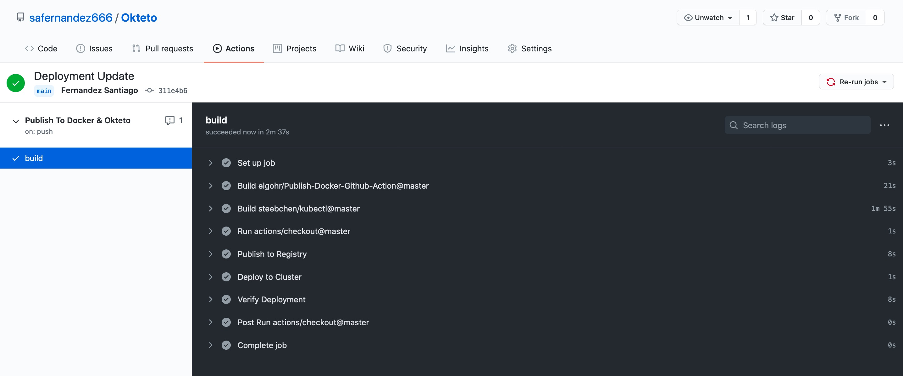
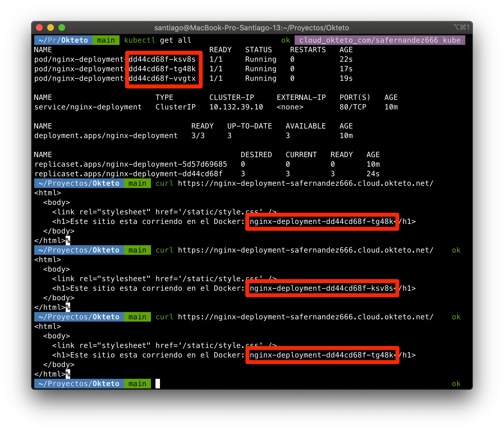
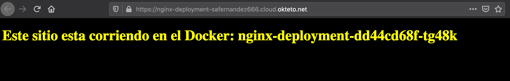

# K8S on Okteto with GitHub Actions

Create a completely free CI \ CD Pipeline. To orchestrate we will use GitHub Actions and [Okteto](okteto.com) as Infrastructure. Build the docker image, publish on Dockerhub and deploy on Kubernetes.

## Configuration 

```bash
cat okteto-kube.config | base64
```
Complete the Secret's Tab on GitHub with Dockerhub Username & Passowrd and Kube Config. You must download the configuration file.

## Secret's on GitHub

<p align="center">

</p>

## Pipeline 

<p align="center">

</p>

## Important

It is important that we generate the first deployment manually, with this command, so that GitHub Actions do not fail.

```bash
export KUBECONFIG=$HOME/Downloads/okteto-kube.config:${KUBECONFIG:-$HOME/.kube/config}

kubectl apply -f ./deployment/deployment.yaml
```

## Checking the Cluster

The first command I retrieve the pods from the deployment. Then I make the queries, via curl, to the EndPoint of the Cluster in Okteto to check the balance.

<p align="center">

</p>


The Website

<p align="center">

</p>